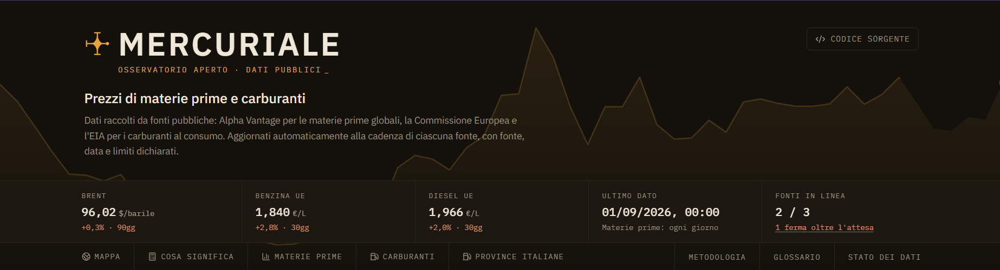
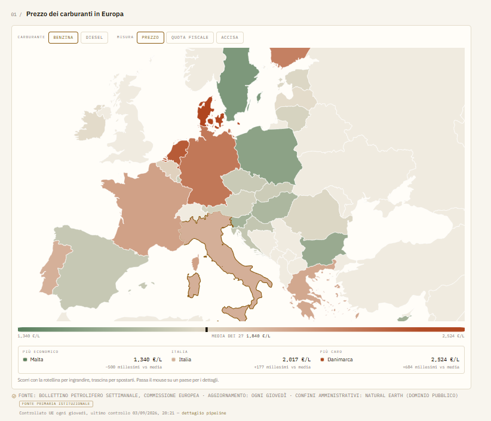
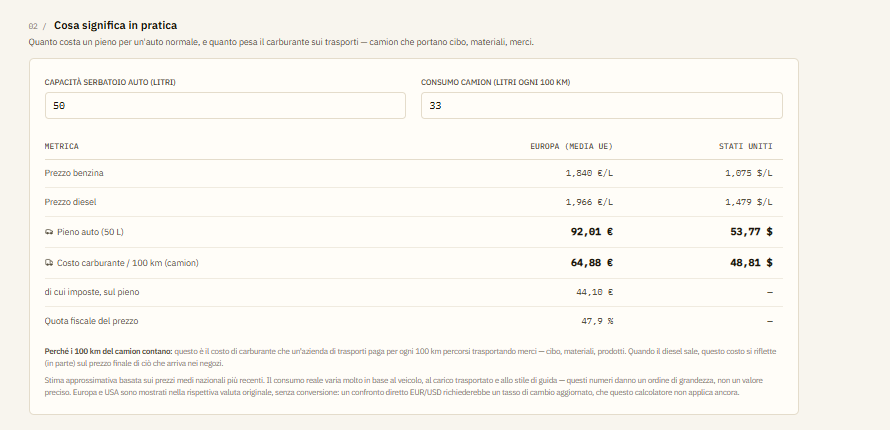
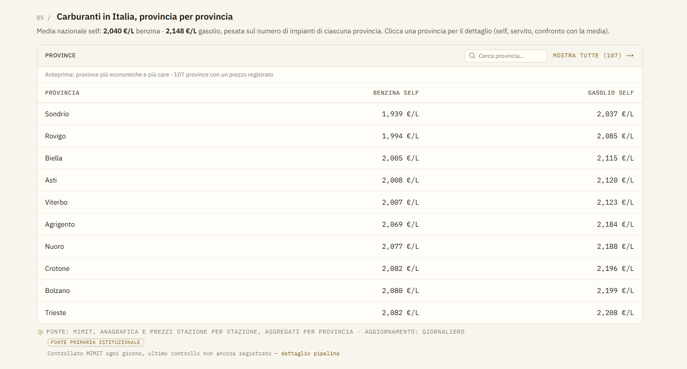
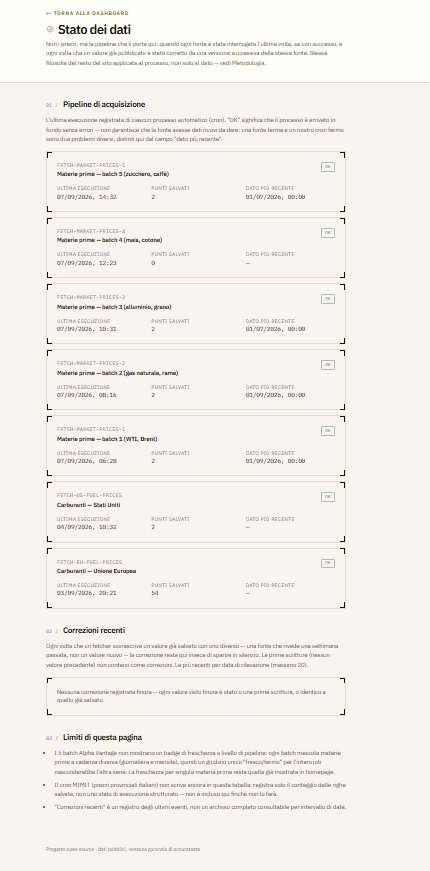

# Mercuriale

Progetto open source di tracciamento prezzi di materie prime globali e
carburanti al consumo: ogni dato con la sua fonte, la sua data e i suoi limiti
dichiarati esplicitamente.

Il nome viene dal *mercuriale*, il listino ufficiale dei prezzi all'ingrosso
che le Camere di Commercio pubblicavano periodicamente: la stessa cosa che
fa questo sito, con fonti diverse. (Il repository resta `commodity-tracker`,
come i nomi di file e le variabili interne.)

**Sito live:** https://commodity-tracker-one-delta.vercel.app



## Perché esiste

I prezzi delle materie prime e dei carburanti esistono già, pubblici, ma
sparsi su bollettini istituzionali diversi (Alpha Vantage, Commissione
Europea, EIA, MIMIT), ognuno con formato, lingua e cadenza propria. Mercuriale
li mette in un unico posto, con una regola sola: **nessun numero senza fonte,
data e limiti dichiarati** — e quando un dato non è più aggiornato, il sito lo
dice invece di nasconderlo dietro un valore che sembra vivo.

## Cosa puoi fare in due minuti

- Vedere il prezzo delle principali materie prime globali (energia, metalli,
  agricole) e la loro variazione recente.
- Confrontare il prezzo dei carburanti tra i 27 paesi UE e gli Stati Uniti su
  una mappa interattiva.
- Cercare la tua provincia italiana e vedere il prezzo medio di benzina e
  gasolio, self e servito, aggiornato ogni giorno stazione per stazione.
- Calcolare il costo reale di un pieno o di 100 km, imposte incluse.
- Controllare tu stesso quando ogni fonte è stata interrogata l'ultima volta,
  nella pagina [Stato dei dati](https://commodity-tracker-one-delta.vercel.app/stato-dati).

| Mappa Europa | Calcolatore |
| --- | --- |
|  |  |

| Province italiane | Stato dei dati |
| --- | --- |
|  |  |

## Stack tecnico

- [Next.js 16](https://nextjs.org) (App Router) + TypeScript
- Tailwind CSS
- Drizzle ORM + [Neon](https://neon.tech) Postgres (serverless)
- Deploy su [Vercel](https://vercel.com), con redeploy automatico a ogni push su `main`
- [Vitest](https://vitest.dev) per le funzioni pure più delicate (formattazione, calcolo di freschezza, statistiche carburanti)
- CI su GitHub Actions (typecheck + lint a ogni push/PR)

## Fonti dati e frequenza di aggiornamento

| Fonte | Dati | Aggiornamento |
| --- | --- | --- |
| [Alpha Vantage](https://www.alphavantage.co/documentation/#commodities) | Materie prime globali (petrolio, gas, metalli, agricole) | Giornaliero per l'energia, mensile per metalli e agricole |
| [Bollettino Petrolifero Settimanale](https://energy.ec.europa.eu/data-and-analysis/weekly-oil-bulletin_en) (Commissione Europea) | Carburanti al consumo, paesi UE | Ogni giovedì |
| [EIA](https://www.eia.gov/opendata/) (U.S. Energy Information Administration) | Carburanti al consumo, USA | Ogni lunedì |
| [MIMIT](https://www.mimit.gov.it/it/open-data/elenco-dataset/carburanti-prezzi-praticati-e-anagrafica-degli-impianti) | Carburanti al consumo, Italia, stazione per stazione aggregati per provincia | Giornaliero |

L'aggiornamento è gestito da cron job schedulati in `vercel.json`, che
chiamano gli endpoint protetti sotto `src/app/api/cron/`. Ogni esecuzione è
registrata in `fetch_runs` e consultabile pubblicamente in
[/stato-dati](https://commodity-tracker-one-delta.vercel.app/stato-dati).

## API pubblica

```
GET /api/data
```

Restituisce in JSON gli ultimi prezzi mostrati sulla dashboard (materie prime
e carburanti UE/USA), senza autenticazione e con CORS aperto. I valori sono
grezzi come salvati dalla fonte, senza conversioni di visualizzazione. Vedi
[`src/app/api/data/route.ts`](src/app/api/data/route.ts).

## Sviluppo locale

```bash
npm install
npm run dev
```

Apri [http://localhost:3000](http://localhost:3000).

### Variabili d'ambiente

Copia `.env.example` in `.env.local` e imposta i valori:

| Variabile | Obbligatoria | Descrizione |
| --- | --- | --- |
| `DATABASE_URL` | sì | Connection string Postgres di Neon |
| `CRON_SECRET` | sì | Stringa segreta che protegge gli endpoint `/api/cron/*` (es. `openssl rand -hex 32`) |
| `ALPHA_VANTAGE_API_KEY` | per il cron materie prime | API key gratuita — https://www.alphavantage.co/support/#api-key |
| `EIA_API_KEY` | per il cron carburanti USA | API key gratuita — https://www.eia.gov/opendata/register.php |

### Comandi utili

```bash
npm run dev            # server di sviluppo
npm run build          # build di produzione
npm test                # suite di test Vitest
npm run db:generate    # genera le migrazioni Drizzle dallo schema
npm run db:migrate     # applica le migrazioni
npm run db:studio      # Drizzle Studio
```

## Contribuire

Segnalazioni di errori, proposte di nuove fonti e correzioni sono benvenute —
vedi [CONTRIBUTING.md](CONTRIBUTING.md) o apri direttamente una
[issue](https://github.com/drakekluser99/Mercuriale/issues/new).

## Licenza

Codice rilasciato sotto licenza [MIT](./LICENSE). I dati di prezzo provengono
da fonti terze (Alpha Vantage, Commissione Europea, EIA, MIMIT), ciascuna con
i propri termini d'uso: non sono coperti dalla licenza del codice.

## Disclaimer

Dati pubblici, **nessuna garanzia di accuratezza**. I prezzi sono medie
nazionali o dati di mercato ritardati, non quotazioni in tempo reale né
prezzi di punti vendita specifici. Vedi la
[pagina Metodologia](https://commodity-tracker-one-delta.vercel.app/metodologia)
per fonti, limiti e frequenza di aggiornamento.

## Autore

Creato da [Yuri Copparini](https://www.linkedin.com/in/yuri-copparini).
